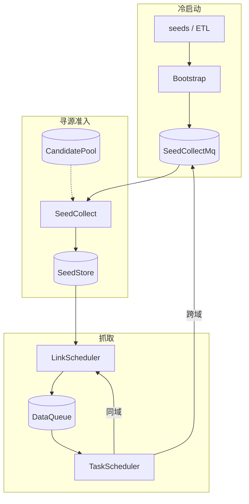

# LLM 语料种子发现与迭代引擎 — 设计文档

> **目标**：从 0 种子起步，可自举地发现、准入、调度与治理语料种子；**采集产物为原始 HTML**（对象存储；离线表 `html` = 对象 URL）。  
> **种子主键**：可注册域（eTLD+1）。

| 文档 | 内容 |
|------|------|
| 本文 [DESIGN.md](./DESIGN.md) | 主设计：寻源 / 迭代 / 调度合规 / 分布式预埋 |
| [DETAILED_DESIGN.md](./DETAILED_DESIGN.md) | 双 MQ、DataQueue、CrawlContext、抓取引擎等实现细节 |
| [DIAGRAMS.md](./DIAGRAMS.md) | 架构图、时序图、状态机 |
| [README.md](./README.md) | 运行说明、默认参数、模块结构 |

实现完整度标记：`[已实现]` · `[部分实现]` · `[未实现]`

---

## 0. 总体架构（摘要）

多进程分工：Bootstrap（一次性）+ LinkScheduler / TaskScheduler / SeedCollect（常驻）。两条 MQ 分离——**SeedCollectMq**（候选种子准入）与 **DataQueue**（抓取任务）。



完整组件与存储图、冷启动/扩链/状态机流程图见 [`DIAGRAMS.md`](./DIAGRAMS.md)。队列与行键设计见 [`DETAILED_DESIGN.md`](./DETAILED_DESIGN.md)。

---

## 1. 初始种子生成

### 1.1 数据源选取原则

候选域名/URL **不绑定具体源名**，按下列原则遴选与加权（多源可并存，单源失效可熔断）：

| 原则 | 说明 |
|------|------|
| **覆盖度** | 覆盖百科/新闻/学术/开源/技术文档等高语料价值垂类；避免单一垂类占满冷启动集 |
| **权威性** | 优先公共可信索引、开放目录、机构域名与人工高质策展；低信任源降权或不入闸 |
| **获取成本** | 优先可批量、可许可、可复现的离线快照；需实时探测的源控制并发与重试上限 |
| **合规与稳定** | 尊重 robots/服务条款；源侧变更可版本化回滚 |
| **可审计** | 每条候选保留 `source_id`、抓取批次、时间戳，支撑复现与追责 |

MVP：[已实现] 以静态 [`seeds.txt`](./seeds.txt) 人工策展代替多源 Ingest；[未实现] 多源定时接入与源级熔断。

### 1.2 价值评估模型（冷启动 / ETL）

离线对候选域打分，特征可量化；得分 ∈ [0,1]，用于排序与截断。

**特征（启发式）**

| 特征 | 含义 | 典型取值 |
|------|------|----------|
| `source_trust` | 数据源信任 | 人工高 / 开放索引中 / 低质量爬取低 |
| `tld_bonus` | TLD 先验 | edu/gov 高，com 中，可疑 TLD 低 |
| `url_health` | URL 结构健康度 | 过深路径、垃圾 query 降分 |
| `reachability` | 探测可达与 HTTP 状态 | 2xx 高，超时/4xx/5xx 低或硬过滤 |
| `content_prior` | 样本页信号 | 标题/长度/结构标签启发（有探测时） |
| `rank_prior` | 外部排序先验 | 可选；缺省中性 |
| `spam_signal` | 垃圾词命中 | 域名/标题含 spam token → 重罚 |

**打分逻辑（线性加权，可替换为决策树）**

```text
score = Σ w_i · f_i  −  spam_penalty · spam_signal
score = clip(score, 0, 1)
```

**决策树式闸门（硬过滤优先于软分）**

```text
若 不可达 / 非 HTML 站点 / 黑名单 TLD 或 spam → 丢弃
若 score < S_min → 丢弃或进入候补池
否则 进入 ranked 列表，参与 Diversity Cut
```

MVP 对齐代码（冷启动 `manual`）：[已实现]

```text
score = 0.40·source_trust + 0.20·tld_bonus + 0.20·url_health + 0.20·rank_prior
→ ACTIVE，weight = max(score, 0.7)
```

`auto_etl` 路径：[部分实现] 有公式接口，完整多特征探测未接。  
独立质量模型服务：[未实现]。

权重配置见 `config.EvaluatorWeights` / `SeedAdmissionEvaluator`（`src/seed/evaluator.py`）。

### 1.3 自动化 ETL 管线（→ 约 1000 种子）

```text
Ingest → Clean → Merge(eTLD+1) → Dedup → Gate → Score → Diversity Cut(K≈1000) → Export
```

| 阶段 | 过程 | 容错与去噪 |
|------|------|------------|
| **采集 Ingest** | 多源拉取 URL/页元数据，带 `source_id` 落快照 | 单源失败熔断，其它源继续；run 标记 `partial` |
| **清洗 Clean** | URL 规范化、去畸形、编码修复；可选受限探测 | 单行 try/except 跳过；超时/5xx 入重试队列（指数退避，有上限）后仍失败记 `reachability=fail` |
| **域名归并 Merge** | 同 eTLD+1 聚合；保留 **首页 + sitemap + 随机内容页**；`page_aggregate` | PSL/tldextract；空组丢弃 |
| **去重 Dedup** | 域精确去重；可选近重复（镜像）合并 | 保留高分侧；冲突记审计 |
| **门禁 Gate** | 硬门槛：可达、非空壳、语言/TLD 策略 | 不过则淘汰并记原因码 |
| **评分 Score** | §1.2 模型；稳定排序（固定随机种子） | 记录 `etl_version` + 源 hash |
| **截断 Cut** | 多样性配额（per-TLD 等）后取 Top-K | 不足从候补回填；不默认开放降阈值重排 |
| **导出 Export** | 发布 SeedCollectMq（`auto_etl`）或版本化 `seeds_vN.txt` + `audit.jsonl` | 可回滚版本 |

流程图：[`DIAGRAMS.md` §3 冷启动](./DIAGRAMS.md#3-冷启动)。运行说明：[README 初始种子生成方案](./README.md#初始种子生成方案)。

| 项 | MVP | 理想态 |
|----|-----|--------|
| 输入 | `seeds.txt` | 多源定时 Ingest |
| Merge | [已实现] `src/etl/domain_merge.py` | 同左 + 探测字段齐全 |
| 全管线 | [部分实现] `AutoEtlPipeline` 演示发布 | [未实现] 探测/Cut/周更调度 |
| 目标规模 | 演示十余条 | K≈1000 可配 |

---

## 2. 种子库持续迭代（核心）

### 2.1 发现与准入

**发现**

1. TaskScheduler 抓取 HTML → Parser 抽取出站链。  
2. **同域**：回投 LinkScheduler → DataQueue（受 `max_depth`、URL 去重约束）。  
3. **跨域**：发布 `SeedCollectMessage(source_type=runtime_cross_domain)` → SeedCollectMq（**不**直接入抓取队列）。

时序图：[`DIAGRAMS.md` §6](./DIAGRAMS.md#6-跨域准入)。

**实时价值评估（quick_score，无额外网络请求）** — [已实现]

特征继承自源种子与锚文本：

| 特征 | 说明 |
|------|------|
| `src_domain_weight × position` | 来源页种子权重 × 链接位置（content/nav/footer/ad） |
| `anchor_quality` | 锚文字长度与信息量启发 |
| `url_health` | 候选 URL 结构 |
| `tld_bonus` | 候选 TLD |
| `in_degree_norm` | 当前互证入度 / `min_in_degree` |
| `spam_signal` | 垃圾词惩罚 |

```text
quick_score = clip(
  w_src · src_weight · pos
  + w_anchor · anchor_quality
  + w_url · url_health
  + w_tld · tld_bonus
  + w_deg · in_degree_norm
  − w_spam · spam_signal
, 0, 1)
```

默认权重见 `config.EvaluatorWeights`（如 src 0.35、in_degree 0.20、spam_penalty 0.30）。

**准入条件（运行时三闸门 + 配额）** — [已实现] 核心闸门；[部分实现] 多样性 ASN 等

| 条件 | 默认 | 含义 |
|------|------|------|
| `quick_score ≥ threshold` | 0.45 | 质量阈值 |
| `in_degree ≥ min_in_degree` | 2 | 不同 `source_domain` 频次/互证（联调可 `--min-in-degree 1`） |
| 周期晋升上限 | `promotions_per_cycle` | 防瞬时灌库 |
| ACTIVE 容量 / per-TLD | `DiversityQuota` | 防膨胀 |
| 候选池 TTL / 容量 | 7 天 / 5e4 | 过期淘汰 |

未过闸门 → **CandidatePool**（落盘）+ offline `candidate_pending`；过闸 → SeedStore `PROBATION`，`scheduled=false`，由 LinkScheduler 投递。

已在库域：更新 `source_domains` / `in_degree`，不重复建档。

### 2.2 库结构与运行时管理

**存储模型 `SeedRecord`（域级）** — [已实现] JSONL 快照；[未实现] MySQL 服务化

| 字段族 | 内容 |
|--------|------|
| 主键 | `domain`（eTLD+1） |
| 入口 | `entry_url` / `homepage_url` / `sitemap_url` / `sample_content_url` |
| 调度 | `weight`、`status`、`scheduled`、`render_mode` |
| 评估 | `quality_score`、`features`、`discovery_source`、`page_aggregate` |
| 可达 | `success_count` / `fail_count` / `consecutive_fail` / `last_*` |
| 产出 | `produced_count`、`avg_quality`、`avg_content_len`、… |
| 图 | `in_degree`、`source_domains` |
| 分类 | `tld`（可扩 lang/asn/topic） |

**索引（逻辑）**

| 索引 | 用途 | MVP |
|------|------|-----|
| PK `domain` | 点查 | 内存 dict + JSONL |
| `(status, weight)` | 调度抽样 | 扫描过滤 |
| `tld` / 未来 asn | 配额 | 扫描计数 |

**接口** — [已实现]

| 接口 | 行为 |
|------|------|
| `apply_evaluation` / `register` | 准入写入 / 合并 |
| `iter_unscheduled_active` / `mark_scheduled` | LinkScheduler 投递 |
| `update_weight` | EWMA 权重 |
| `record_reachability` / `record_production` | 抓取反馈 |
| `promote` / `evict` / `set_status` | 升降级 |
| `load` / `save` | 快照 |

实现：`src/stores/seed_store.py`。状态机：[`DIAGRAMS.md` §7](./DIAGRAMS.md#7-种子状态)。

### 2.3 动态调整与淘汰

**权重更新（EWMA）** — [已实现]

```text
new_weight = α · old_weight + (1−α) · reward
α 默认 0.8（config.WeightUpdateConfig）
```

| 反馈 | reward | 说明 |
|------|--------|------|
| 抓取成功且入库 HTML | `0.2 + 0.8 · html_quality` | 内容启发分 |
| 重复内容 | 较低正奖励 | 防刷重 |
| 抓取失败 | `0` | 降权 |

**老化 / 暂停 / 移除**

| 规则 | 行为 | 状态 |
|------|------|------|
| `consecutive_fail ≥ max_consecutive_fail`（默认 5） | → `SUSPENDED` | [已实现] |
| PROBATION 且产出足够且 `avg_quality` 过低 | → `EVICTED` | [已实现] |
| ACTIVE 持续低质 | 降权；权重极低可 evict | [已实现] |
| 时间衰减僵尸高分 | 按时间衰减 weight | [未实现] |
| SUSPENDED 自动恢复探测 | 探测成功 → ACTIVE | [未实现] |

### 2.4 治理机制

目标：防膨胀、防垃圾渗透、维持高信噪比。

| 策略 | 说明 | 状态 |
|------|------|------|
| 准入互证 | `min_in_degree`、score 阈值 | [已实现] |
| 容量与配额 | `active_capacity`、`max_active_per_tld` | [已实现] 容量/TLD；ASN 配额字段预留 [部分实现] |
| 晋升限速 | `promotions_per_cycle` | [已实现] |
| 候选池 TTL/容量 | 过期与弱者淘汰 | [已实现] |
| 周期治理 | promote / evict / demote | [已实现] `src/seed/governance.py` |
| 采集农场检测 | 图结构异常簇 | [未实现] `detect_link_farm` 占位 |
| 黑名单同步 | 全局黑域 | [部分实现] 有接口槽，运营流未建 |

治理周期图：[`DIAGRAMS.md` §9](./DIAGRAMS.md#9-权重与治理)。

---

## 3. 调度与合规（简述）

### 3.1 基于种子权重的优先级

- 调度单元 = **URL**；入队优先级 ≈ **所属种子 `weight`**（sitemap/entry 角色可加权）。  
- LinkScheduler：仅投递 `ACTIVE/PROBATION` 且 `scheduled=false` 的种子入口，再同域扩链。  
- DataQueue：per-domain Topic；子队列 **retry > normal**（RowKey 字典序）。  

细节：[`DETAILED_DESIGN.md` §2](./DETAILED_DESIGN.md#2-dataqueue)。  
MVP：[已实现] 权重入队 + DataQueue；[未实现] 独立 freshness/politeness 合成公式的精细化调参。

### 3.2 robots.txt

| 层级 | 设计 |
|------|------|
| **MVP** | `RobotsCache`：未加载规则时**默认放行**；`respect_robots` 可关。抓取前 `allowed(domain, url)`。[部分实现] |
| **生产化** | 首次遇域异步拉取 `/robots.txt`，TTL 缓存；UA 精细匹配；Sitemap 发现回填 `sitemap_url`；429/403 与 Disallow 联动退避；合规审计日志。[未实现] |

### 3.3 域级速率与去重

| 机制 | 设计 | 状态 |
|------|------|------|
| 域级礼貌 | DataQueue **按 topic 独立令牌桶**（默认 `consume_rate_per_second` + `domain_qps`）；抓取侧 **`max_concurrency_per_host`**；`per_domain_min_interval` 未接通 | [已实现] 域名出队 QPS + 单域抓取并发；[未实现] 抓取间隔 / robots crawl-delay |
| URL 去重 | Bloom（概率）+ 精确集合 | [已实现] `src/crawl/dedup.py`（MVP 精确为主，Bloom 可扩展） |
| 内容去重 | HTML 内容哈希 | [已实现] ContentDedup |
| 跨 Worker 去重服务 | 独立 Dedup 层 | [未实现] |

抓取并发/超时/会话复用见 README「异步抓取引擎」与 [`DETAILED_DESIGN.md` §5](./DETAILED_DESIGN.md#5-抓取实现要点)。

---

## 4. 分布式演进预埋

下列切面在 MVP 用本地文件模拟，接口已拆分，便于替换：

| 切面 | MVP | 演进 |
|------|-----|------|
| 种子库 | 内存 + JSONL | MySQL/服务化；读写 API；多副本 |
| Worker | 三进程手工启动 | 无状态容器；按域分片消费 DataQueue |
| 去重 | 进程内 | 独立 Dedup 服务 / Redis Bloom |
| SeedCollectMq | 文件目录 | Kafka / Redis Streams |
| DataQueue | 本地 Redis meta + 文件 HBase | 真 Redis 集群 + HBase Region |
| CrawlContext | 本地 JSON | HBase 表；禁止大对象内存透传（已遵循） |
| 对象存储 | Local mirror + s3 URL 形态 | S3/OSS 真客户端 |
| 抓取升级 | L1 aiohttp | L1.5 指纹 → L2 Playwright → L3 代理 [未实现] |
| 配置/编排 | config.py + CLI | 配置中心；K8s/服务发现 [未实现] |

---

```
src/workers/     常驻入口
src/scheduling/  Link / Task 实现
src/mq/          SeedCollectMq + FileMessageQueue
src/stores/      SeedStore / DataQueue / 对象与离线存储
src/crawl/       Fetcher / Parser / robots / dedup
src/seed/        Evaluator / Governance
src/etl/         域名归并
config.py        Admission / Fetch / Diversity 等
```
