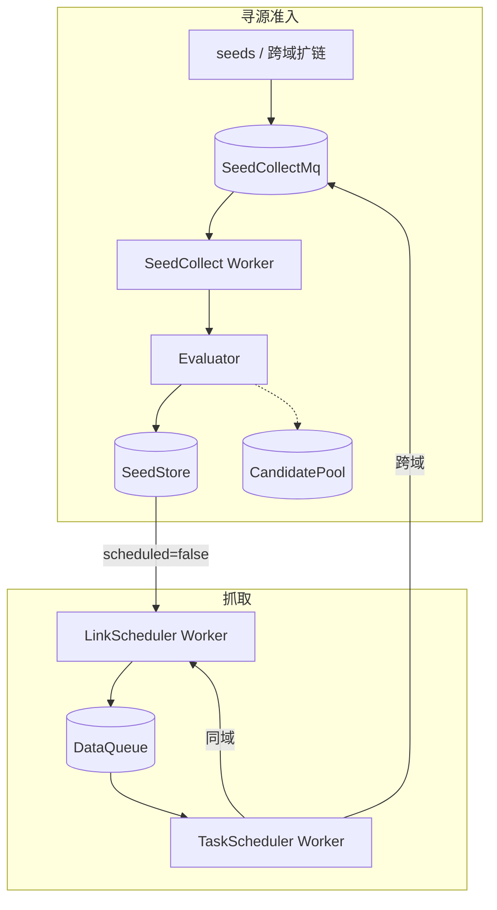
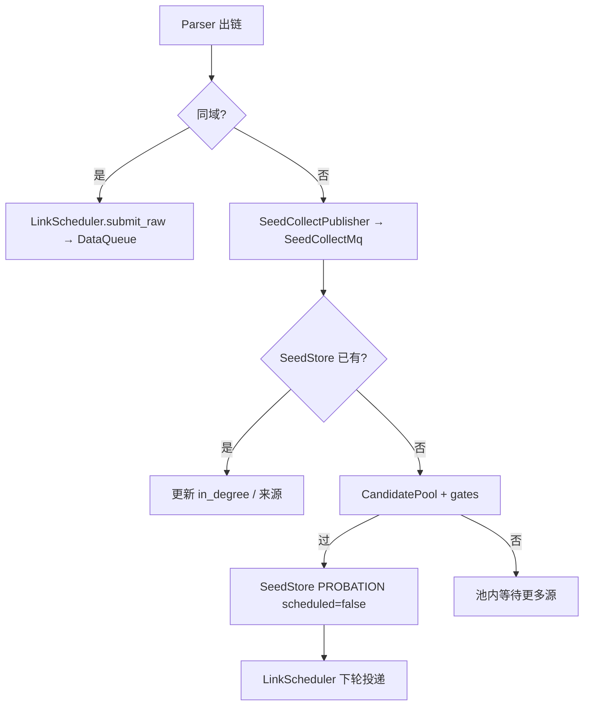

# 详细设计（DETAILED_DESIGN）

> 实现细节补充。主设计（寻源 / 迭代 / 调度 / 演进）见 [`DESIGN.md`](./DESIGN.md)。  
> 流程图见 [`DIAGRAMS.md`](./DIAGRAMS.md)。运行说明见 [`README.md`](./README.md)。

---

## 0. 双 MQ 与进程边界



| 角色 | 入口 |
|------|------|
| 冷启动 | `python -m src.bootstrap` |
| 寻源消费 | `python -m src.workers.seed_collect` |
| 入队 | `python -m src.workers.link_scheduler` |
| 抓取 | `python -m src.workers.task_scheduler` |

准入后写入 SeedStore 时 **`scheduled=false`**，不直接 publish DataQueue。

### 0.1 SeedCollectMessage

| 字段 | 说明 |
|------|------|
| `domain` / `entry_url` | 候选种子 |
| `source_type` | `manual` / `auto_etl` / `runtime_cross_domain` |
| `source_domain` / `source_url` / `anchor` / `depth` | 运行时扩链上下文 |

Topic：`config.seed_collect_mq.topic`（默认 `seed.collect`），后端目录 `seed_collect_mq.base_dir`。

### 0.2 评估与闸门

| source_type | 评估 | SeedStore 状态 |
|-------------|------|----------------|
| `manual` | 高信任启发式 | `ACTIVE` |
| `auto_etl` | 离线打分 | `ACTIVE` / `PROBATION` |
| `runtime_cross_domain` | `quick_score` | 过闸 → `PROBATION`；否则进 CandidatePool |

运行时闸门（`_passes_runtime_gates`）：

- `in_degree >= min_in_degree`（不同 `source_domain` 计数）
- `quick_score >= quick_score_threshold`
- 周期晋升上限、ACTIVE 容量、per-TLD 配额

CandidatePool 落盘：`admission.candidate_pool_path`（默认 `output/candidate_pool.json`）。  
SeedCollect 每次处理 MQ 后会 `promote_ready_candidates` 并 save 池。

离线审计：`offline/seed_collect_consumer/` 中 `action=candidate_pending|admitted_*`（日志，非状态源）。

---

## 1. 运行时扩链



同域受 `schedule.max_depth` 与 URL 去重约束。

---

## 2. DataQueue

主链路：`LinkScheduler.publish` → `TaskScheduler.consume`。

### 2.1 分工

| 层 | 职责 | MVP |
|----|------|-----|
| HBase 消息体 | RowKey 持久化 | `LocalHBaseMessageStore`（目录文件） |
| Redis 元数据 | 锁、offset、分区、Buffer、限速 | `FileRedisMetaStore`（跨进程） |

子队列：`retry` 优先于 `normal`。

### 2.2 Topic = per domain

```
Topic = {topic_prefix}.{domain_encoded}
例：crawl.link.task.example_com → example.com
```

元数据与消费位点均按 Topic 隔离。

### 2.3 RowKey

```
RowKey = {retry|normal}{partition}{offset}
例：normal020000000019
```

### 2.4 生产 / 消费

**生产**：domain 锁 → 分配 partition/offset → 写 HBase → Context 记录 `topic/row_key`。

**消费**：轮询 Topics → Buffer 限速 → 成功 `ack` / 失败 `retry` 同 domain。

### 2.5 代码

```
src/stores/data_queue/
  topic.py / models.py / redis_meta.py
  file_redis_meta.py / hbase_store.py / queue.py
src/mq/                 # FileMessageQueue / SeedCollectMq
src/scheduling/         # LinkScheduler / TaskScheduler
src/stores/             # SeedStore / offline / object / result_store
```

配置：`DataQueueConfig`（`partition_count`、`buffer_capacity`、`consume_rate_per_second` 默认 per-domain QPS、`domain_qps` 按域覆盖等）。消费侧令牌桶按 topic（域名）独立，互不影响。

---

## 3. CrawlContext

- 主键 `context_id`；关联 url/domain/parent；节点列表记录 link_scheduler / data_queue / fetch / parse / store
- MVP：`output/hbase/crawl_context/{context_id}.json`
- TaskScheduler 各阶段 `context_store.update`，失败不写 HTML

---

## 4. SeedStore 字段要点

| 字段 | 作用 |
|------|------|
| `status` / `weight` / `scheduled` | 生命周期与是否已投递 DataQueue |
| `reachability.*` | 成功/失败/连续失败；达 `max_consecutive_fail` → `SUSPENDED` |
| `production.*` | HTML 产出统计 |
| `graph.in_degree` / `source_domains` | 引用图 |

接口：`apply_evaluation`、`iter_unscheduled_active`、`mark_scheduled`、`record_reachability`、`update_weight`、`promote` / `evict`。

---

## 5. 抓取实现要点

- Fetcher：`AiohttpFetcher`（`ClientSession` 复用 + `TCPConnector` 连接池；`total/connect/sock_read` 超时；可重试状态码指数退避）
- 并发：TaskScheduler Worker 按 `FetchConfig.concurrency` 控制 in-flight（默认 16）
- 配置：`config.FetchConfig` 默认值；CLI `--concurrency/--timeout/--max-retries/...` 可覆盖（见 README）
- `--self-test` 注入 `MockFetcher`
- 非 HTML / 非 200 → `ok=False`；挑战检测可升级（浏览器路径为接口预留）
- 存储：`ResultStore` → ObjectStore；`metadata.jsonl` 与 offline `resource` 的 `html` 为对象 URL
- robots：`RobotsCache`；未拉到规则时默认放行（`respect_robots` 可关）
