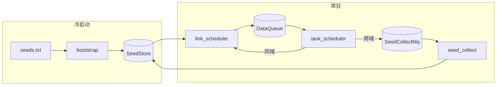
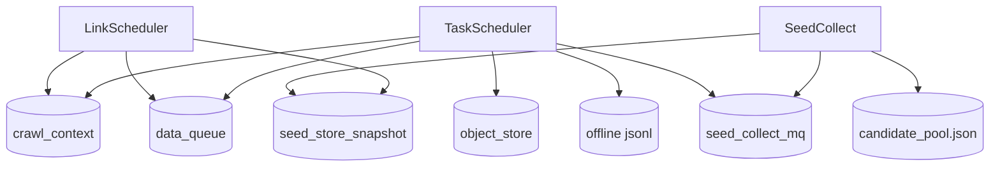
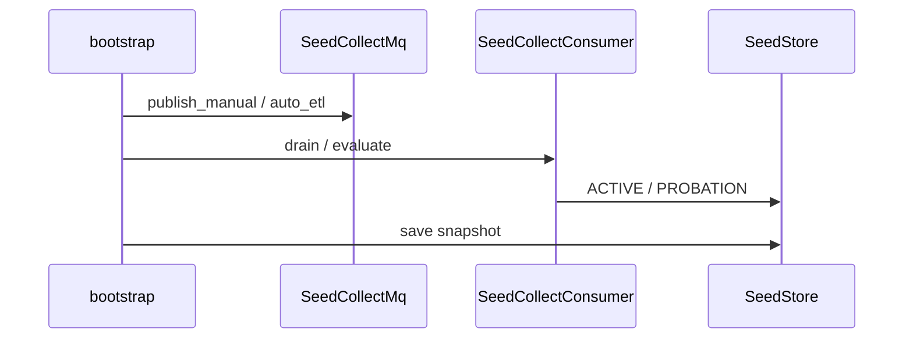
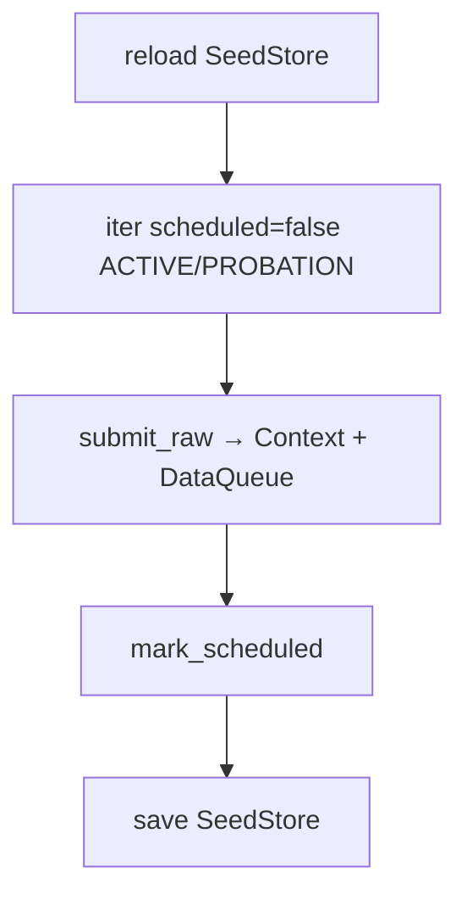
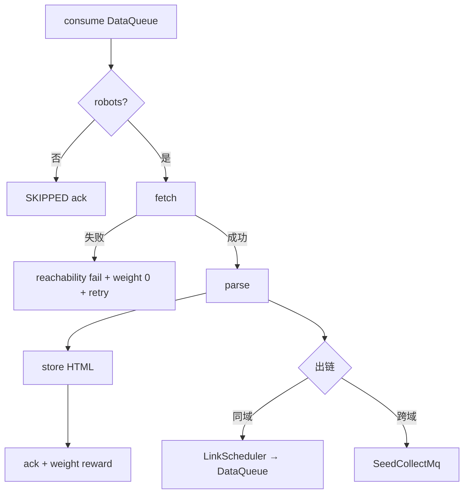
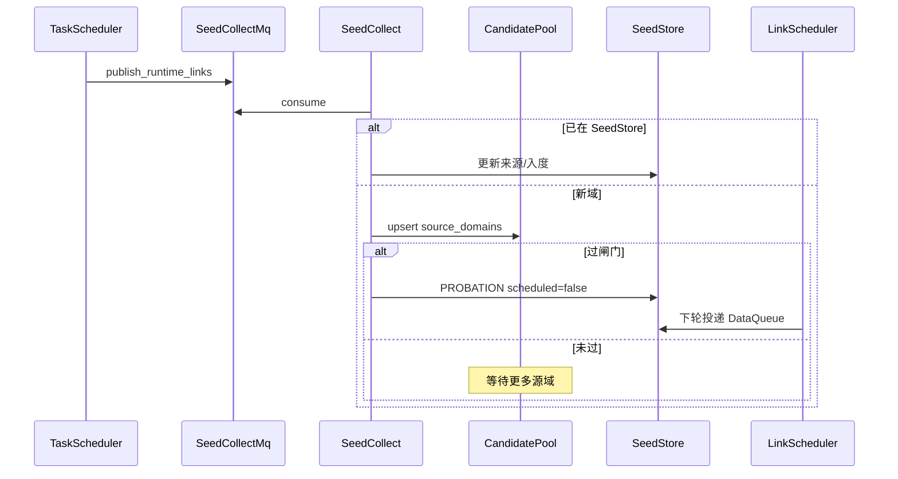
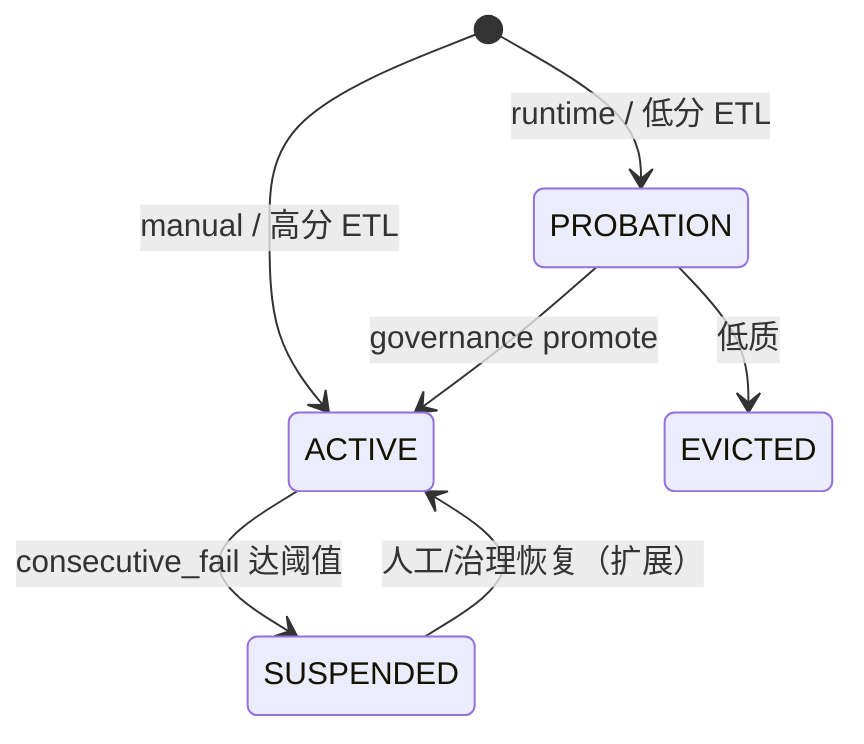
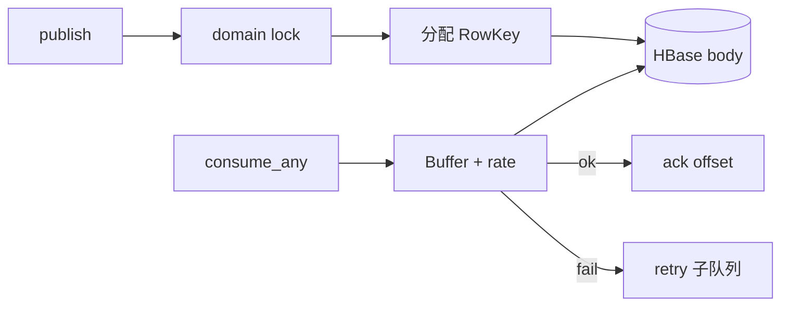
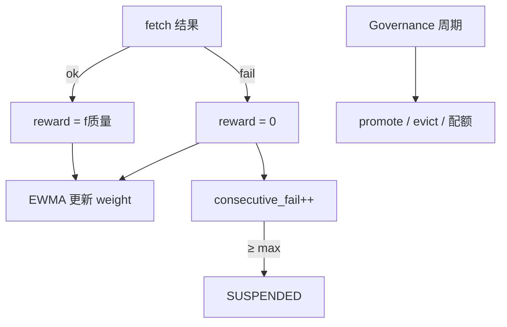

# 流程图（DIAGRAMS）

> 架构 / 时序 / 状态图。设计论述见 [`DESIGN.md`](./DESIGN.md)；实现细节见 [`DETAILED_DESIGN.md`](./DETAILED_DESIGN.md)。

---

## 1. 总览

---

## 2. 组件与存储

---

## 3. 冷启动

---

## 4. LinkScheduler 周期

---

## 5. TaskScheduler 单任务

---

## 6. 跨域准入

---

## 7. 种子状态

---

## 8. DataQueue 生产消费

---

## 9. 权重与治理

